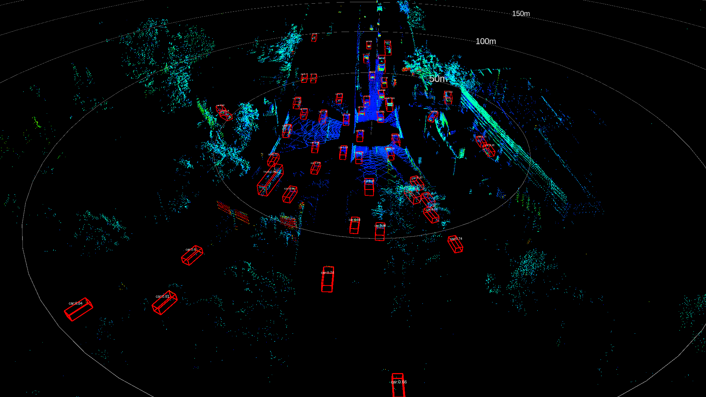
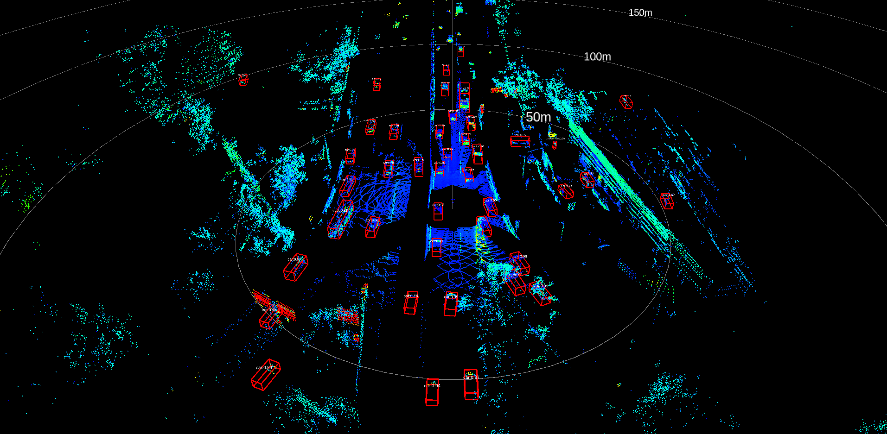

## Livox Detection V1.1: trained based on LivoxDataset_v1.0 [\[LivoxDataset\]](https://www.livoxtech.com/cn/dataset)
The detector can run at least 20 FPS on 2080TI for 200m*100m range detection. The provided model was trained on LivoxDataset_v1.0 within 1w pointcloud sequence.

## News
`2020.08.31` : livox_detection V1.0 released:100m*50m detction for single Livox lidars, run at least 90FPS on 2080Ti

`2020.11.26` : livox_detection V1.1 released: Support 360 degree detection (200m * 100m) with Livox lidars, run at least 20FPS on 2080Ti

## Demo
<div align="center"></div>

<div align="center"></div>

Video Demo: [demo1](https://terra-1-g.djicdn.com/65c028cd298f4669a7f0e40e50ba1131/github/Livox_detection1.1_demo1.mp4) 
[demo2](https://terra-1-g.djicdn.com/65c028cd298f4669a7f0e40e50ba1131/github/Livox_detection1.1_demo2.mp4)
[demo3](https://terra-1-g.djicdn.com/65c028cd298f4669a7f0e40e50ba1131/github/Livox_detection1.1_demo3.mp4)

# Introduction
Livox Detection is a robust,real time detection package for [*Livox LiDARs*](https://www.livoxtech.com/). The detector is designed for L3 and L4 autonomous driving. It can effectively detect within 200*100m range under different vehicle speed conditions(`0~120km/h`). In addition, the detector can perform effective detection in different scenarios, such as high-speed scenes, structured urban road scenes, complex intersection scenes and some unstructured road scenes, etc. In addition, the detector is currently able to effectively detect 3D bounding boxes of five types of objects: `cars`, `trucks`, `bus`, `bimo` and `pedestrians`.

# Dependencies
- `python3.6+`
- `tensorflow1.13+` (tested on 1.13.0)
- `pybind11`
- `ros`

# Installation

1. Clone this repository.
2. Clone `pybind11` from [pybind11](https://github.com/pybind/pybind11).
```bash
$ cd utils/lib_cpp
$ git clone https://github.com/pybind/pybind11.git
```
3. Compile C++ module in utils/lib_cpp by running the following command.
```bash
$ mkdir build && cd build
$ cmake -DCMAKE_BUILD_TYPE=Release ..
$ make
```
4. copy the `lib_cpp.so` to root directory:
```bash
$ cp lib_cpp.so ../../../
```

5. Download the [pre_trained model](https://terra-1-g.djicdn.com/65c028cd298f4669a7f0e40e50ba1131/github/Livox_detection1.1_model.zip) and unzip it to the root directory.

# Run

### For sequence frame detection

Download the provided rosbags : [rosbag](https://terra-1-g.djicdn.com/65c028cd298f4669a7f0e40e50ba1131/github/livox_detection_v1.1_data.zip) and then

```bash
$ roscore

$ rviz -d ./config/show.rviz

$ python livox_rosdetection.py

$ rosbag play *.bag -r 0.1
```
The network inference time is around `24ms`, but the point cloud data preprocessing module takes a lot of time based on python. If you want to get a faster real time detection demo, you can modify the point cloud data preprocessing module with c++.

To play with your own rosbag, please change your rosbag topic to `/livox/lidar`.

# Support
You can get support from Livox with the following methods :
- Send email to cs@livoxtech.com with a clear description of your problem and your setup
- Report issue on github
